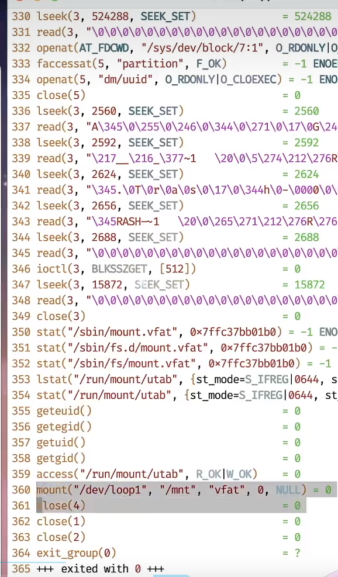
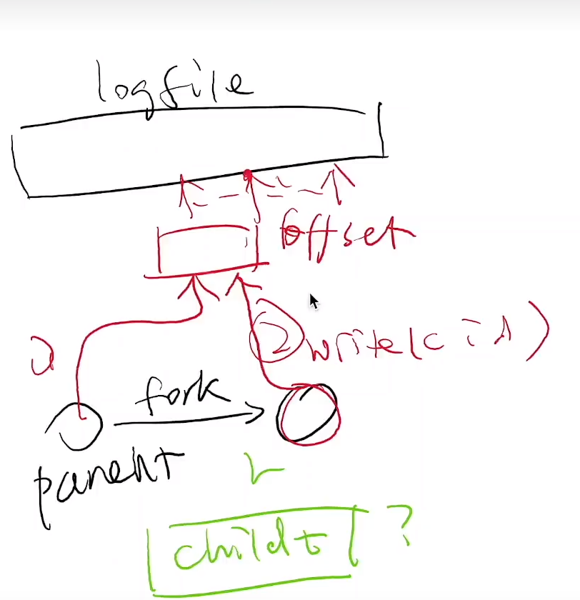

```c
#include <stdio.h>
#include "thread.h"

// 多线程可以正常打印
// warn:也不能100%保证必定是线程安全的顺序，在打印超长字符串的时候
void use_printf(const char *s) {
  printf("%s", s);
}

// 多线程之间的状态冲突 。。。
void use_putchar(const char *s) {
  for (; *s; s++) {
    putchar(*s);
  }
}

void (*print)(const char *) = use_printf;

void Tworker() {
  char buf[128];
  int c = gettid() % 4 + 1;
  sprintf(buf, "\033[3%dm%d\033[0m", c, c);
  while (1) {
    print(buf);
  }
}

int main(int argc, char *argv[]) {
  if (argc > 1) {
    print = use_putchar;
  }

  setbuf(stdout, NULL);
  for (int i = 0; i < 4; i++) {
    create(Tworker);//创建线程 
  }
}
```

引出问题 如何实现设备之间共享？

为什么printf在一定程度上可以保证顺序 ?

- man 2 write  

SYNOPSIS  
<text>#include <unistd.h></text>  
ssize_t write(int fd, const void *buf, size_t count)

For  a seekable file (i.e., one to which lseek(2) may be applied, for example, a regular file) writing takes place at the file offset, and the file offset is incremented by the number of bytes actually written.  If the file was open(2)ed with O_APPEND, the file offset is first set to the end of the file  before writing.  ```The adjustment of the file offset and the write operation are performed as an atomic step.```

对于可查找的文件（即，可以应用 lseek(2) 的文件，例如，常规文件）写入发生在文件偏移量处，并且文件偏移量增加实际写入的字节数。 如果使用 O_APPEND 打开（2）文件，则文件偏移量在写入之前首先设置为文件末尾。 文件偏移量的调整和写入操作作为原子步骤执行。

> 小技巧
在读man手册的时候 输入可以搜索 关键词进行搜索
比如 输入 ```/atomic``` 就可以快速搜索到关键词的位置

## 文件系统的设计

文件系统：虚拟磁盘

- 文件系统：设计目标  

1. 提供合理的 API 使多个应用程序能共享数据
2. 提供一定的隔离，使恶意/出错程序的伤害不能任意扩大

- “存储设备 (字节序列) 的虚拟化”
  - 磁盘 (I/O 设备) = 一个可以读/写的字节序列
  - 虚拟磁盘 (文件) = 一个可以读/写的动态字节序列
    - 命名管理
      - 虚拟磁盘的名称、检索和遍历
    - 数据管理
      - std::vector`<char>` (随机读写/resize)

```个人理解:磁盘就是可以创建多个虚拟磁盘给各个应用程序```

</br>

---

## 文件系统最简单的实现就是key-value  

问题：对遍历不友好
问题的实际场景：删除一个用户的部分文件

几种可以考虑的索引方式：

- 哈希索引  
- 平衡树索引

## unix 文件系统设计

### 目录树的拼接

UNIX: 允许任意目录 “挂载 (mount)” 一个设备代表的目录树

非常灵活的设计
可以把设备挂载到任何想要的位置
Linux 安装时的 “mount point”
/, /home, /var 可以是独立的磁盘设备
mount 系统调用

```c
int mount(const char *source, const char *target,
          const char *filesystemtype, unsigned long mountflags,
          const void *data);
```

mount /dev/sdb /mnt (RTFM)
Linux mount 工具能自动检测文件系统 (busybox 不能)
甚至可以挂载一个文件系统的文件  

使用unmount取消挂载

### 最小linux的加载过程

Linux-minimal 运行在 “initramfs” 模式

Initial RAM file system

- 完整的文件系统
- 可以包含设备驱动等任何文件 (launcher.c)
- 但不具有 “持久化” 的能力

最小 “真正” Linux 的启动流程

```shell
export PATH=/bin
busybox mknod /dev/sda b 8 0  #创建磁盘设备驱动节点
busybox mkdir -p /newroot
busybox mount -t ext2 /dev/sda /newroot #挂载
exec busybox switch_root /newroot/ /etc/init #重新设置根目录 
```

busybox switch_root 原理：
通过 pivot_root (2) 实现根文件系统的切换

### 文件的挂载

文件的挂载引入了一个微妙的循环

- 文件 = 磁盘上的虚拟磁盘
- 挂载文件 = 在虚拟磁盘上虚拟出的虚拟磁盘 🤔

Linux 的处理方式

- 创建一个 loopback (回环) 设备

> 实现创建一个回环设备方法
1 在/dev/sda1上有文件中有 /dir/disk.img
2 使用指令 sudo mount disk.img /mnt
mnt下挂载的新的磁盘又指向了磁盘/dev/sda1  

</br>

原理
对回环设备的全部转发给文件
设备驱动把回环设备的 read/write 翻译成文件的 read/write

- 观察 disk-img.tar.gz 的挂载
实验过程

lsblk 查看系统中的 block devices (strace)
strace 观察挂载的流程

```shell
# 观察 mount的 系统调用然后 将结果放入 vim
sudo strace mount disk.img /mnt | vim -A 
```


在365行可以看出以最终实际挂载到/dev/loop1 检测出文件系统格式是 vfat
如何检测到是  vfat 打开文件读取  

从strace 可以看出打开的磁盘文件描述符号是指向文件的

</br>

```shell
ioctl(3, LOOP_CTL_GET_FREE)
ioctl(4, LOOP_SET_FD, 3)
```

一些API  这里只写不熟悉的部分  


>This is not the function you are interested in. Look at readdir(3) for the POSIX conforming C library interface. This page documents the bare kernel system call interface.
 The system call getdents() reads several dirent structures from the directory pointed at by fd into the memory area pointed to by dirp. The parameter count is the size of the memory area.
//更多请阅读：<https://www.yiibai.com/unix_system_calls/getdents.html>

</br>

- [Filesystem Hierarchy Standard (FHS) doc](https://refspecs.linuxfoundation.org/FHS_3.0/fhs/index.html)
FHS enables software and user to predict the location of installed files and directories.

显示文件的唯一编号

```shell
ls -i
```

> ls man
  -i, --inode
  print the index number of each file

## 链接

### 硬 (hard) 链接

需求：系统中可能有同一个运行库的多个版本

libc-2.27.so, libc-2.26.so, ...
还需要一个 “当前版本的 libc”
程序需要链接 “libc.so.6”，能否避免文件的一份拷贝？
硬连接：允许一个文件被多个目录引用

目录中仅存储指向文件数据的指针

- 链接目录 ❌
- 跨文件系统 ❌
- 大部分 UNIX 文件系统所有文件都是硬连接 (ls -i 查看)

删除的系统调用称为 “unlink” (引用计数)

### 软 (symbolic) 链接

软链接：在文件里存储一个 “跳转提示”

- 软链接也是一个文件
当引用这个文件时，去找另一个文件
另一个文件的绝对/相对路径以文本形式存储在文件里
可以跨文件系统、可以链接目录、……
类似 “快捷方式”

- 链接指向的位置当前不存在也没关系

~/usb → /media/jyy-usb
~/Desktop → /mnt/c/Users/jyy/Desktop (WSL)
ln -s 创建软链接

symlink 系统调用

> warn:
  软链接的跳转次数是存在限制的，超过次数不能跳转

### 软链接带来的麻烦

- “任意链接” 允许创建任意有向图 😂

- 允许多次间接链接
a → b → c (递归解析)
可以创建软连接的硬链接 (因为软链接也是文件)
ls -i 可以看到

- 允许成环
fish.c 自动机的目录版本：fish-dir.sh
find -L A | tr -d '/'
可以做成一个 “迷宫游戏”
  - ssh 进入游戏，进入名为 end 的目录胜利
  - 只允许 ls (-i), cd, pwd
所有处理符号链接的程序 (tree, find, ...) 都要考虑递归的情况

## 选择当前的工作目录

chdir

不同进程都是有独立的工作目录


## 文件API

复习：mmap
使用 open 打开一个文件后

用 MAP_SHARED 将文件映射到地址空间中
用 MAP_PRIVATE 创建一个 copy-on-write 的副本

```c
void *mmap(void *addr, size_t length, int prot, int flags,
  int fd, off_t offset); // 映射 fd 的 offset 开始的 length 字节
int munmap(void *addr, size_t length);
int msync(void *addr, size_t length, int flags);
```

- 小问题：
映射的长度超过文件大小会发生什么？
(RTFM, “Errors” section): SIGBUS...
bus error 的常见来源 (M5)
ftruncate 可以改变文件大小

open 的原理
open 打开某个文件 文件描述符 相当于指向某个虚拟磁盘的指针而且带有位置

- 文件：虚拟的磁盘
磁盘是一个 “字节序列”
支持读/写操作

- 文件描述符：进程访问文件 (操作系统对象) 的 “指针”
通过 open/pipe 获得
通过 close 释放
通过 dup/dup2 复制
fork 时继承

## 偏移量管理：没那么简单 (2)

文件描述符在 fork 时会被子进程继承。

- 父子进程应该共用偏移量，还是应该各自持有偏移量？
这决定了 offset 存储在哪里
考虑应用场景

- 父子进程同时写入文件
各自持有偏移量 → 父子进程需要协调偏移量的竞争
(race condition)
共享偏移量 → 操作系统管理偏移量
虽然仍然共享，但操作系统保证 write 的原子性 ✅

父子进程共享统一个描述符 写入同一个文件  文件不会会导致出错
父子进程的文件描述符会引用 同一个文件描述符的offset  
任意一个文件描述符偏移都会移动 同一个文件描述符offset  



# 偏移量管理：行为
操作系统的每一个 API 都可能和其他 API 有交互 😂

open 时，获得一个独立的 offset
dup 时，两个文件描述符共享 offset
fork 时，父子进程共享 offset
execve 时文件描述符不变

O_APPEND 方式打开的文件，偏移量永远在最后 (无论是否 fork)
modification of the file offset and the write operation are performed as a single atomic step
这也是 fork 被批评的一个原因

(在当时) 好的设计可能成为系统演化过程中的包袱
今天的 fork 可谓是 “补丁满满”；A fork() in the road