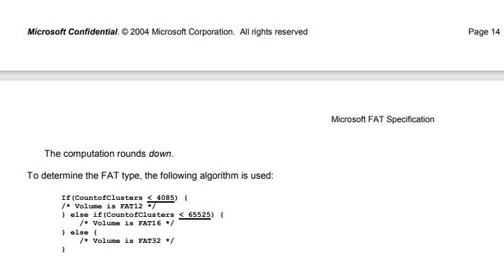
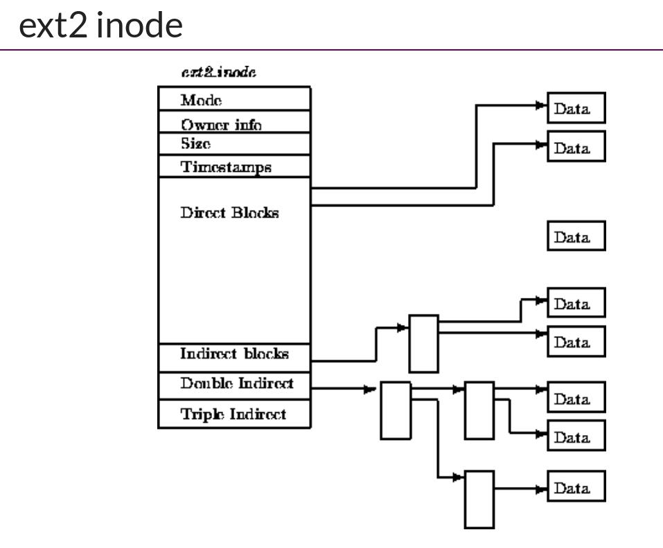

# 27FAT和UNIX文件系统

[课件地址](http://jyywiki.cn/OS/2022/slides/27.slides#/)

----

## 数据结构和文件系统的一些不同

- 数据结构课程的假设
  - 冯诺依曼计算机
    Random Access Memory (RAM)
    Word Addressing (例如 32/64-bit load/store)
    每条指令执行的代价是
    - Memory Hierarchy 在苦苦支撑这个假设 (cache-unfriendly 代码也会引起  性能问题)

</br>

- 文件系统的假设
<font color=Green>按块 (例如 4KB) 访问，在磁盘上构建 RAM 模型完全不切实际</font>

## 文件系统数据结构的实现

> 底层是相当与byte array
根据索引从byte array找到block set
block set 上的block 根据某种结构使用链表串联在一起
文件夹可以设计成数据结构struct dirent
在bock 上面的 char\* 数据结构可以强转成结构 dirent\* 表示目录


- Block device 提供的设备抽象

```c
struct block blocks[NBLK]; // 磁盘
void bread(int id, struct block *buf) {
  memcpy(buf, &blocks[id], sizeof(struct block));
}
void bwrite(int id, const struct block *buf) {
  memcpy(&blocks[id], buf, sizeof(struct block));
}
```

在 bread/bwrite 上实现块的分配与回收 (与 pmm 类似)

```c
int balloc(); // 返回一个空闲可用的数据块
void bfree(int id); // 释放一个数据块
```

balloc bfree 可以使用相当于 malloc 的空闲链表去实现  

在 balloc/bfree 上实现磁盘的虚拟化

- 文件 = vector\<char>
用链表/索引/任何数据结构维护
支持任意位置修改和 resize 两种操作
在文件基础上实现目录

- “目录文件”
把 vector\<char> 解读成 vector<dir_entry>
连续的字节存储一个目录项 (directory entry)

---

## FAT文件系统(File Allocation Table (FAT))

fat 文件具有通用性和相对简单性，使用广泛性 在u盘上广泛存在，uefi也是fat

### 问题

- 5.25" 软盘：单面 180 KiB

360 个 512B 扇区 (sectors)
在这样的设备上实现文件系统，应该选用怎样的数据结构？

```c
int balloc(); // 返回一个空闲可用的数据块
void bfree(int id); // 释放一个数据块
vector<struct block *> file; // 文件
```

// 文件的名称、大小等保存在目录中
注意到这是相当小的文件系统

- 树状的目录结构
系统中以小文件为主 (几个 block 以内)
文件的实现方式
</br>
- truct block * 的链表
任何复杂的高级数据结构都显得浪费

#### 用链表存储数据：两种设计

- 在每个数据块后放置指针
优点：实现简单、无须单独开辟存储空间
缺点：数据的大小不是 $2^k$ ; 单纯的 lseek 需要读整块数据(无法克服)
  - 最坏情况 阅读最后一块sector 必须全部读一遍文件才能 访问


</br>

- 将指针集中存放在文件系统的某个区域
优点：局部性好；lseek 更快 (可以将此部分区域加载到，内存速度更快)
缺点：集中存放的数据损坏将导致数据丢失（恰巧保存指针的区域数据发生损坏....,这一块的区域也是最容易损坏的区域）(解决办法 备份)


</br>

### <font size=6 color=RED>FAT的设计</font>


12 16 32 的单位是bit

<font size=8>[FAT doc by Microsoft(link)](http://jyywiki.cn/pages/OS/manuals/MSFAT-spec.pdf)</font>

如何判断FAT 12 16 32

<mark>判断块的数量</mark>

#### special

- RTFM 得到必要的细节
诸如 tutorial、博客都不可靠
还会丢失很多重要的细节

> 如何克服读手册的恐惧：先从最简单的手册读起，比如上方的FAT doc by Microsoft 仅仅只有 30+ 页数 ，需要培养

### 创建一个 fat32文件系统

创建100M 文件

```shell
yes | head -c  104857600 > fs.img #创建100M字符y大小给fs.img
```

- yes 指令
yes - output a string repeatedly until killed
- head
head c命令可用于查看文件的开头部分的内容
-c<数目> 显示的字节数。
- \> fs.img
重定向到文件fs.img

查看文件类型

```shell
file fs.img
fs.img: ASCII text
```

- hd alias hexdump
hexdump - display file contents in hexadecimal, decimal, octal, or ascii

dump fs.img

```shell
 hd fs.img 
00000000  79 0a 79 0a 79 0a 79 0a  79 0a 79 0a 79 0a 79 0a  |y.y.y.y.y.y.y.y.|
*
06400000

```

创建fat 文件系统

```shell
$ mkfs.fat -F 32  -v fs.img 
mkfs.fat 4.2 (2021-01-31)
fs.img has 8 heads and 32 sectors per track,
hidden sectors 0x0000;
logical sector size is 512,
using 0xf8 media descriptor, with 204800 sectors;
drive number 0x80;
filesystem has 2 32-bit FATs and 1 sector per cluster.
FAT size is 1576 sectors, and provides 201616 clusters.
There are 32 reserved sectors.
Volume ID is 9fe3d53e, no volume label
```

```shell
$ file fs.img 
fs.img: DOS/MBR boot sector, code offset 0x58+2, OEM-ID "mkfs.fat", Media descriptor 0xf8, sectors/track 32, 
heads 8, sectors 204800 (volumes > 32 MB), FAT (32 bit), sectors/FAT 1576, serial number 0x9fe3d53e, unlabeled
```

code

- 然后，把整个磁盘镜像 mmap 进内存
照抄手册，遍历目录树：fatree.c

FAT 性能

- ＋ 小文件简直太合适了
- － 但大文件的随机访问就不行了
4 GB 的文件跳到末尾 (4 KB cluster) 有  次链表 next 操作
缓存能部分解决这个问题
在 FAT 时代，磁盘连续访问性能更佳
使用时间久的磁盘会产生碎片 (fragmentation)
malloc 也会产生碎片，不过对性能影响不太大

可靠性

- 维护若干个 FAT 的副本防止元数据损坏  

额外的同步开销

- 损坏的 cluster 在 FAT 中标记

更好的文件系统需要什么
| | |
| --- | --- |
| Most files are small | Roughly 2K is the most common size
| Average file size is growing | Almost 200K is the average
| Most bytes are stored in large files | A few big files use most of the space
| File systems contains lots of files | Almost 100K on average
| File systems are roughly half full | Even as disks grow, file systems | remain ~50% full
| Directories are typically small | Many have few entries; most have 20 or | fewer

## ext2/UNIX 文件系统

- 按对象方式集中存储文件/目录元数据
  - 增强局部性 (更易于缓存)
  - 支持链接

- 为大小文件区分 fast/slow path (在下图找那个inode中有体现)
  - 小的时候应该用数组
  连链表遍历都省了
  
  - 大的时候应该用树 (B-Tree; Radix-Tree; ...)
  快速的随机访问




ext2: 性能与可靠性
大文件的随机读写性能提升明显 ()

支持链接 (一定程度减少空间浪费)
inode 在磁盘上连续存储，便于缓存/预取
依然有碎片的问题
但可靠性依然是个很大的问题

存储 inode 的数据块损坏是很严重的
总结
本次课回答的问题

Q: 如何在磁盘上实现文件系统 API？
“图书馆” - mkdir, rmdir, link, unlink, open, ...
“图书/书签” - read, write, mmap, lseek, ...
Takeaway messages

文件系统实现 = 自底向上设计实现数据结构
balloc/bfree
FAT/inode/...
文件和目录文件
End.
24 / 27

ext2: 性能与可靠性
大文件的随机读写性能提升明显 ( O ( 1 ) )

- 支持链接 (一定程度减少空间浪费) ‘
- inode 在磁盘上连续存储，便于缓存/预取
- 依然有碎片的问题

- 但可靠性依然是个很大的问题
存储 inode 的数据块损坏是很严重的
